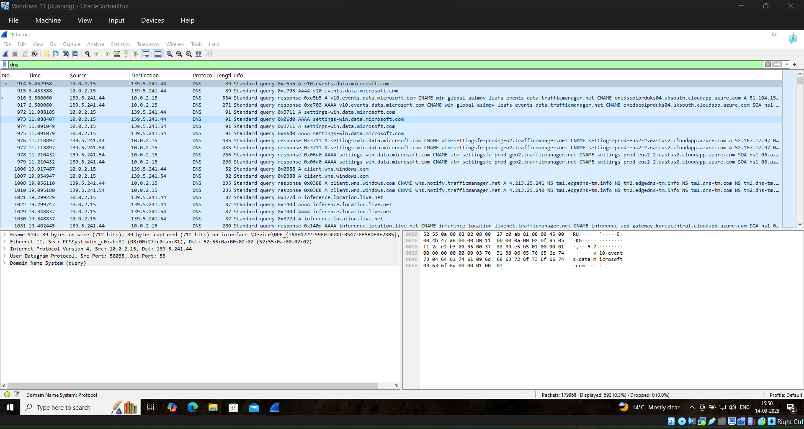
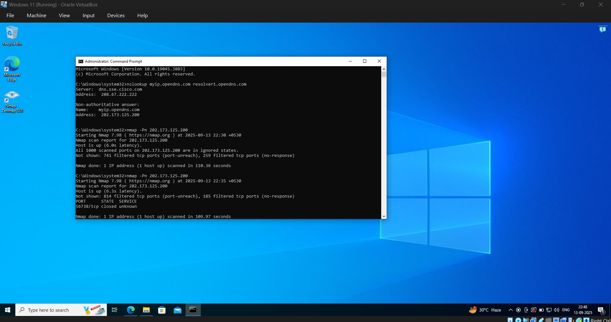
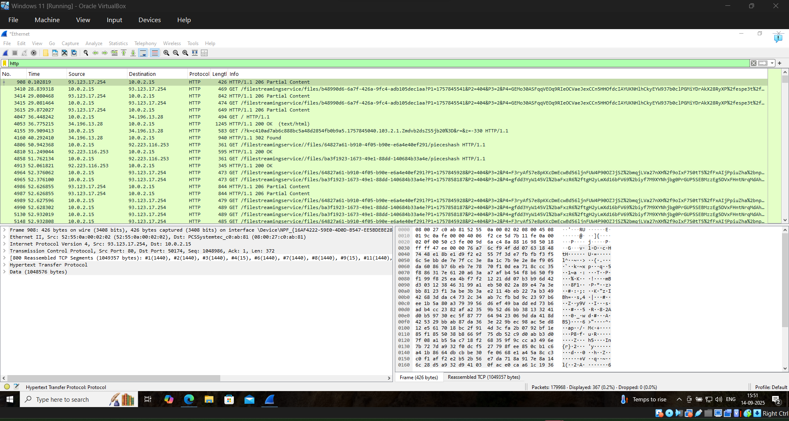
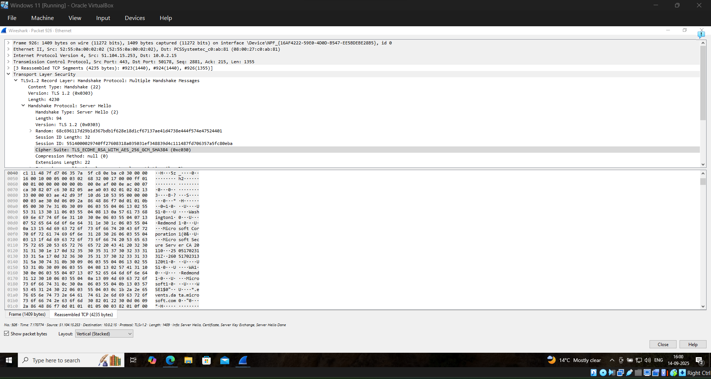

# network-security-analysis
## 📌 Overview
This project demonstrates basic network security implementation and traffic analysis using industry standard tools.

## 🎯 Objectives
- Understand common network threats
- Implement basic security measures
- Monitor and analyze network traffic

## 🛠 Tools Used
- Wireshark
- Nmap
- Windows Defender Firewall
- Router Configuration (WPA2 Security)

## 🔧 Work Performed
- Changed default router credentials to improve security
- Configured WPA2 encryption and disabled WPS
- Enabled Windows Defender Firewall
- Performed network scanning using Nmap
- Captured live network traffic using Wireshark
- Analyzed DNS, HTTP and TLS protocols

## 📸 Screenshots
## DNS Capture

### 🔍 DNS Resolution
This screenshot shows DNS queries captured using Wireshark. The system is resolving domain names (e.g., Microsoft services) into IP addresses. It demonstrates how devices communicate with DNS servers before establishing connections with external services.

## Nmap Scan

### 🛠️ Nmap Scan Result
This screenshot displays the results of an Nmap scan performed on the public IP address. Most ports are shown as filtered, indicating that a firewall is actively blocking incoming traffic. This reduces the attack surface and improves overall network security.

## HTTP Traffic

### 🌐 HTTP Traffic Analysis
This screenshot shows HTTP traffic captured in Wireshark. Unlike HTTPS, HTTP traffic is unencrypted meaning the data can be read in plaintext. This highlights the security risk of using HTTP for sensitive communication.

## TLS Handshake

### 🔐 TLS Handshake Analysis
This screenshot illustrates the TLS handshake process, including Client Hello and Server Hello messages. It demonstrates how a secure HTTPS connection is established before data is encrypted and transmitted securely.

## 📊 Key Findings
- No open ports were exposed indicating strong firewall protection
- DNS traffic showed normal system level communication
- HTTP traffic was visible in plaintext highlighting security risks
- TLS traffic was encrypted after handshake ensuring secure communication

## 🧠 Learning Outcomes
- Learned how to analyze network traffic using Wireshark
- Understood differences between HTTP and HTTPS
- Gained hands on experience with Nmap scanning
- Identified how encryption protects network data

## 🚀 Future Improvements
- Implement IDS/IPS systems
- Explore advanced packet analysis
- Perform deeper vulnerability assessments

  ## 📄 Detailed Report
A complete report of this project is available below:

[View Full Report](network-security-report.pdf)
